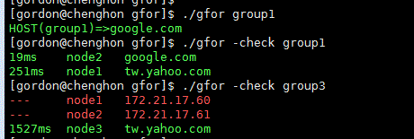

gfor - Go HOST
------------


###Usage
```
-c string
    YAML directory (default ".")
-d    
    Debug mode
-nocache
    Cache mode [default Cached]
-check
    Health Check, will not get host [default false]
```
###DEMO


###PHP Extension
- set extension shard object
   - extension=php_gfor.so
```
<?php
host = gfor_host($group, $conf)
gfor_health($group, $conf)
?>
```

Author: Gordon Wang <gordon.tw@gmail.com>
